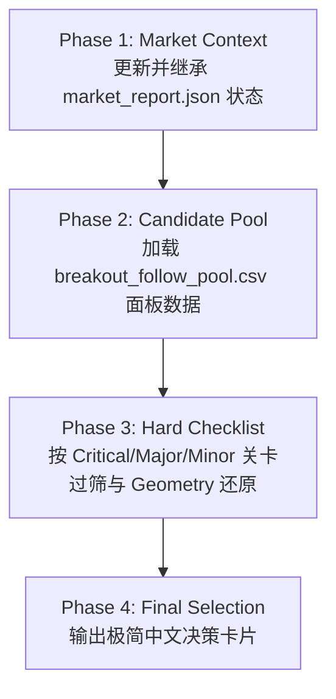

# IBD Candidate Pre-screen Skill Specification

## Mission

本 Skill 的核心职责是 **突破候选池快速预筛 (Pre-screen Review)**。

* **定位**：针对 Dashboard 突破候选池的高效筛选与结构研判关卡。
* **目标**：应用 O'Neil / IBD 经典图表与基本面卡尺，剔除不合格标的，精选**最多 3 只**具备高质量突破特征的标的供人工 Review。
* **原则 (宁缺毋滥)**：推荐上限 3 只（允许输出 0~3 只）。若无高质量标的或抛压风险过高，严禁凑数推荐。

---

## Non-goals

本 Skill 明确**不负责**以下事项：
- 预测股票未来走势或目标价位；
- 给出仓位配比或建仓/卖出操作指令；
- 修改 Dashboard 或策略池原始数据；
- 覆盖 Hard Checklist 的硬性过滤结果；
- 使用未提供的数据字段自行推导新指标。

---

## Decision Philosophy

**Rule-based First, Experience-assisted Second**：
1. **规则优先**：严格依据 Dashboard 数据与 IBD 对齐的分层检查表 (Tiered Checklist) 进行过滤；
2. **经验辅助**：仅在规则允许范围内，结合 O'Neil 原著经验对突破几何质量进行解释；
3. **不可覆盖**：当规则与经验冲突时，必须以规则过滤结果为准；
4. **Signal-aware Interpretation**：同一检查点可根据不同 Signal 使用不同阶段字段进行评估，但不得改变检查点本身的 IBD 核心含义。

---

## Market Context

* **前置子仓库更新**：在预筛前，必须优先运行 `git submodule update --remote market_analysis` 自动更新并获取最新大盘研报；该步骤会刷新 `market_analysis` 子仓库 checkout，若父仓库因此出现 submodule 指针变更，须在报告或交付中显式说明。
* **唯一权威大盘信源**：大盘环境与市场状态统一来源于只读文件 `market_analysis/output/market_report.json`（直接继承状态、派发日及板块拥挤度，作为背景参考，严禁 AI 重新判断大盘趋势或单纯因 Correction 淘汰合格候选）。

---

## Data Sources

1. **`market_analysis/output/market_report.json`**：大盘环境、派发日及板块拥挤度背景。
2. **`us/breakout_follow_pool.csv` (Dashboard 候选池)**：提取 Header、DAILY ENTRY、PULLBACK、CANSLIM / BASE 面板数据。

---

## Core Principles

1. **精选上限与宁缺毋滥**：最终推荐最多 3 只（0~3 只）。
2. **心流状态优先**：优先遴选 Dashboard 中 `ibd_entry_status == 'ACTIONABLE'` 的标的；若非 ACTIONABLE，须显式说明瓶颈。
3. **行业分散与拥挤风控**：单一板块不超过 2 只；某板块占比 > 50% 时触发拥挤风控，该板块推荐**最多 1 只**并发出风险预警。
4. **分层卡尺制 (Tiered Checklist)**：按照 Critical (淘汰门槛)、Major (质量权衡)、Minor (辅助提示) 关卡执行结构化判定；Minor 中 #10 仅执行下述正向加分语义。

---

## Breakout Geometry (突破日线图几何结构)

结合 Dashboard 中由上游正式产出的价格行为字段（`ibd_entry_close_position`, `ibd_entry_breakout_range_ratio`），导出核心几何参数；`ibd_entry_close_vs_trigger_pct` 只作为上游突破有效性上下文，不参与本 Geometry 分类：
* **买点位置分位**：$trigger\_pos = pos - range\_ratio = \frac{Trigger - Low}{High - Low}$
* **上影线区间占比**：$CloseToHighGapRatio = 1 - pos = \frac{High - Close}{High - Low}$

### 核心分类与防御规则
* **Full-range 突破 (Gap / Full-range Breakout)**：`trigger_pos <= 0`（即 `range_ratio >= pos`），且 `pos >= 0.80`
* **光头强突破 (Strong Finish)**：`pos >= 0.80` 且 `range_ratio >= 0.50`，但 `trigger_pos > 0`
* **缺口回落 (Faded Gap)**：`trigger_pos <= 0`（全天在 Trigger 之上），但 `pos ∈ [0.65, 0.80)`。仍为 Strong Breakout，但收盘回落意味着日内存在卖压。
* **扎实突破 (Constructive Breakout)**：满足以下之一：(a) `pos >= 0.80` 但 `rr < 0.50` 且 `trigger_pos > 0`（光头收盘但穿透薄）；(b) `pos ∈ [0.65, 0.80)` 且 `rr >= 0.50` 且 `trigger_pos > 0`（收盘合格且穿透实质）。
* **薄穿突破 (Marginal Breakout)**：`pos ∈ [0.65, 0.80)` 且 `rr < 0.50`。收盘刚过及格线、穿透力不足，需其他条件补强。
* **冲高回落/上影线抛压 (Squat / Upper Shadow)**：`pos < 0.65`（上影线 $> 35\%$）。此项为一票否决：无论 `range_ratio` 多大，均不得升级为 Gap / Full-range Breakout。
* **防御规则 (Defensive Rule)**：若 $range\_ratio \le 0$ ($Close \le Trigger$)，触发防守断路器，直接判定破位失败。

---

## IBD 对齐的分层检查表 (IBD-aligned Tiered Checklist)

| 级别 | # | 检查点 | 判定标准 (Pass / Fail) | 规则依据与权威引用源 (Citations & Rules) |
|:--:|:--:|:--|:--|:--|
| **Critical** | 1 | 买点新鲜度 | 距 Candidate Price ≤ 5.0% | **IBD Standard Buy Zone**：O'Neil 标准买入窗口为 Pivot 0%–5%（原著 Chapter 2），与 Dashboard ACTIONABLE 状态一致；≤ 2% 为 Fresh Zone，排序中优先。 |
| **Critical** | 2 | 突破日放量 | Entry Volume Ratio ≥ 1.5x | **IBD Heavy Volume**：机构建仓放量确认（IBD 官方标准为至少高于均量 40%~50%，即 1.40x~1.50x）。 |
| **Critical** | 3 | 突破日质量 | Close Position ≥ 0.65 | **Project Strict Rule**：O'Neil 底线为 Upper Half (≥0.50)（原著 Chapter 2）；Top Third (≥0.67) 为 IBD 教学实战经验；本项目取 ≥0.65 作为折中阈值；光头强需 pos ≥ 0.80。 |
| **Major** | 4 | Base / Handle 深度健康 | 符合对应 Base / Handle 的经典 IBD 深度特征 | 对 `ceiling` / `ceiling_breakout` / `ceiling_pullback` 使用 `base_depth_pct`，结合具体 Base 类型（Cup 12%–33%（原著 Chapter 2）/ Flat Base ≤15% / Double Bottom 等）原著区间判定；其他 Continuation 信号使用 `pullback_pct` 评估近期巩固 (Pullback) 深度。严禁混用！ |
| **Major** | 5 | 基底/巩固时长合理 | 符合对应 Base / Handle 的经典 IBD 持续时间特征 | **IBD Base Duration**：对 Base 信号强制使用 `base_duration_weeks`（Cup ≥7周、Flat Base ≥5周），对 Continuation 信号使用上游正式产出的 `pullback_duration_weeks`。严禁混用！ |
| **Major** | 6 | 巩固期地量缩量 | `pullback_v_is_dry == True` | **Project Rule**：经典 IBD 底部/柄部地量缩量沉淀 (Volume Dry-up)。若上游未来正式产出缩量比例字段，可作为补充说明，不得自行推导。 |
| **Minor** | 7 | 价格紧贴 52 周高点 | 距 52 周高点 > -5.0% | **Project Rule**：对应 `dist_to_52w_high_pct`，测量价格距高点距离（注意：非 RS Rating / RS Line 独立指标）。 |
| **Major** | 8 | 基本面支撑 | EPS YoY 增长 ≥ 25% | **CANSLIM (C Rule)**：O'Neil 经典 C 规则要求最近季度 EPS YoY 增长至少 25%（注：年度 EPS 增长需独立字段）。 |
| **Minor** | 9 | 净筹码吸纳 | 近 10 周上涨周成交量 > 下跌周成交量 | **Project Rule**：机构资金持续积累代理指标 (Accumulation Proxy)。 |
| **Minor** | 10 | 周线量能跟进 | 当周 Volume Ratio ≥ 1.3x | **Project Rule**：周线级别的放量跟进确认 (对应 `volume_ratio`)。 |

> **执行语义 & 字段路由 (Signal-aware Evaluation)**：
> 1. **关卡分级**：Critical 为硬性淘汰；Major 作为主要权衡；Minor #7 / #9 用于内部排序与风险提示，#10 仅作正向加分。若所需且适用的字段不存在或为空，则标记为 UNKNOWN，严禁自行推导或假设其结果。
> 2. **阶段路由**：Checklist #4 (Depth) 与 #5 (Duration) 必须根据 `ibd_candidate_rule` 与真实回撤阶段自动路由对应字段：
>    - 初始 Base 突破 (`ibd_candidate_rule == 'ceiling'`) → 强制使用 `base_depth_pct` / `base_duration_weeks`；
>    - 回踩确认 (`ceiling_pullback`, `ma10_touch_confirm`) → 强制使用 `pullback_pct` / `pullback_duration_weeks`；
>    - Pivot / Three-Weeks-Tight → 仅当 `pullback_count > 0` 时评估 `pullback_pct` / `pullback_duration_weeks`。严禁跨阶段混用！
> 3. **字段适用性先于缺失判断**：`ceiling` 首次突破只评估 `base_depth_pct` / `base_duration_weeks`；这是刚站上大型平台的阶段，不得读取或报告 `pullback_v_is_dry`、`pullback_pct`、`pullback_duration_weeks` 缺失。回撤缩量、回撤深度和回撤持续时间仅当信号存在实际回撤阶段时才评估。
> 4. **上游正式字段约束**：`pullback_duration_weeks` 必须来自上游正式导出；若 Continuation 信号确实需要该字段但 CSV 未提供，才可写作“回撤时长数据未导出”，不得自行用其它字段替代。
> 5. **日线优先**：先判断突破质量、买点距离与突破日量能，再评估 Base / Pullback、缩量和 EPS；周线量能不参与硬性淘汰。
> 6. **周线量能仅加分**：周线量能达到 `1.3x` 时，作为“优势”中的加分项展示；低于 `1.3x` 或缺失时直接省略，不得作为拒绝、降级或风险理由。
> 7. **内部状态不外显**：Critical / Major / Minor 与 PASS / FAIL / UNKNOWN 仅供内部判定；最终报告须翻译为带数字的中文理由。缺失字段仅在确实影响结论时写作“数据缺失”。

---

## 标准执行流程 (Workflow)



---

## 输出格式 (Output Format)

按以下顺序输出，先给决定，再给依据：

- **长度**：正文最多 20 行；省略空区块及没有影响结论的数据。
- **结论**：一句话说明优先复核谁、谁值得留意；不凑数。
- **背景**：仅当大盘状态或板块拥挤实际影响结论时补充一句。
- **优先复核**：0~3 只。每只固定 3 行，依次为“突破日 / 优势 / 判断”。
- **值得留意**：0~2 只。仅收录日线突破突出但结构、基本面或关键数据证据不完整的标的；不等同于推荐。每只固定 3 行，依次为“突破日 / 顾虑 / 判断”。
- **暂不优先**：最多列 3 只代表性标的，每只只写一个真正影响优先级的主要原因；若仍有明显亮点，先写亮点再写原因。
- **名称**：Breakout Quality 使用 Dashboard 原始名称，不自行翻译或创造同义等级。
- **语言**：判断只写自然语言结论，不复述内部层级、计数或检查过程。
- **数字**：只保留原始业务数据，不输出检查项数量或通过/失败统计。

```markdown
# IBD 候选预筛

## 结论

[一句话说明最优先标的、值得留意标的及是否宁缺毋滥。]

[背景：大盘或板块影响结论时补充；其余情况省略。]

## 优先复核

### [TICKER]
- **突破日：** [Breakout Quality]｜收盘位置 [pos]｜突破幅度 [range_ratio]｜量能 [entry volume]x
- **优势：** [最多两个带数字的主要理由；周线量能仅在 ≥1.3x 时作为加分]
- **判断：** [一句话说明为什么值得先做人工 Review]

## 值得留意

### [TICKER]
- **突破日：** [Breakout Quality]｜收盘位置 [pos]｜突破幅度 [range_ratio]｜量能 [entry volume]x
- **顾虑：** [最多两个真正影响判断的结构、基本面或数据缺口]
- **判断：** [一句话说明为何观察但不列第一优先]

## 暂不优先

- **[TICKER]：** [可选亮点]，但 [一个决定性原因 + 数字]
```

---

## Implementation Notes

1. **大盘报告路径**：`market_analysis/output/market_report.json`。
2. **候选池 CSV 路径**：`us/breakout_follow_pool.csv` (加载入口 `dashboard.data_utils.load_pool_csv`)。
