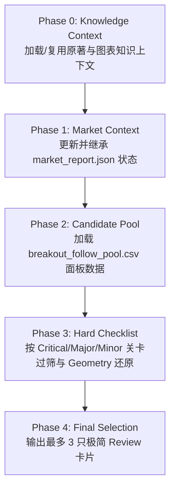

# IBD Candidate Pre-screen Skill Specification

## Mission

本 Skill 的核心职责是 **突破候选池快速预筛 (Pre-screen Review)**。

* **定位**：针对 Dashboard 突破候选池的高效筛选与结构研判关卡。
* **目标**：应用 O'Neil / IBD 经典图表与基本面卡尺，剔除不合格标的，精选**最多 3 只**具备高质量突破特征的标的供人工 Review。
* **原则 (宁缺毋滥)**：推荐上限 3 只（允许输出 0~3 只）。若无高质量标的或抛压风险过高，严禁凑数推荐。

---

## Non-goals

本 Skill 明确**不负责**以下事项：
- 预测股票未来走势或目标价位；
- 给出仓位配比或建仓/卖出操作指令；
- 修改 Dashboard 或策略池原始数据；
- 覆盖 Hard Checklist 的硬性过滤结果；
- 使用未提供的数据字段自行推导新指标。

---

## Decision Philosophy

**Rule-based First, Experience-assisted Second**：
1. **规则优先**：严格依据 Dashboard 数据与 10 项 Hard Checklist 进行过滤；
2. **经验辅助**：仅在规则允许范围内，结合 O'Neil 原著经验对突破几何质量进行解释；
3. **不可覆盖**：当规则与经验冲突时，必须以规则过滤结果为准；
4. **Signal-aware Interpretation**：同一检查点可根据不同 Signal 使用不同阶段字段进行评估，但不得改变检查点本身的 IBD 核心含义。

---

## Knowledge Context

* **原著知识上下文**：优先建立/复用 William O'Neil 《How to Make Money in Stocks》原著知识上下文；若未建立或加载失败，须在报告开头显式说明并降低经验解释置信度。

---

## Market Context

* **前置只读更新**：在预筛前，优先运行 `git submodule update --remote market_analysis` 自动更新并获取最新大盘研报。
* **唯一权威大盘信源**：大盘环境与市场状态统一来源于只读文件 `market_analysis/output/market_report.json`（直接继承状态、派发日及板块拥挤度，严禁 AI 重新判断大盘趋势）。

---

## Data Sources

1. **`market_analysis/output/market_report.json`**：大盘环境、派发日及板块拥挤度背景。
2. **`us/breakout_follow_pool.csv` (Dashboard 候选池)**：提取 Header、DAILY ENTRY、PULLBACK、CANSLIM / BASE 面板数据。

---

## Core Principles

1. **精选上限与宁缺毋滥**：最终推荐最多 3 只（0~3 只）。
2. **心流状态优先**：优先遴选 Dashboard 中 `ibd_entry_status == 'ACTIONABLE'` 的标的；若非 ACTIONABLE，须显式说明瓶颈。
3. **行业分散与拥挤风控**：单一板块不超过 2 只；某板块占比 > 50% 时触发拥挤风控，该板块推荐**最多 1 只**并发出风险预警。
4. **硬性卡尺制 (Hard Checklist)**：10 项检查点执行严格 PASS / FAIL 判定。

---

## Breakout Geometry (突破日线图几何结构)

结合 Dashboard 3 大原始字段（`ibd_entry_close_position`, `ibd_entry_close_vs_trigger_pct`, `ibd_entry_breakout_range_ratio`），导出核心几何参数：
* **买点位置分位**：$trigger\_pos = pos - range\_ratio = \frac{Trigger - Low}{High - Low}$
* **上影线占比**：$UpperShadowRatio = 1 - pos = \frac{High - Close}{High - Low}$

### 核心分类与防御规则
* **Full-range 突破 (Gap / Full-range Breakout)**：`trigger_pos <= 0`（即 `range_ratio >= pos`），且 `pos >= 0.80`
* **光头强突破 (Strong Finish)**：`pos >= 0.80` 且 `range_ratio >= 0.50`，但 `trigger_pos > 0`
* **冲高回落/上影线抛压 (Squat / Upper Shadow)**：`pos < 0.65`（上影线 $> 35\%$）。此项为一票否决：无论 `range_ratio` 多大，均不得升级为 Gap / Full-range Breakout。
* **防御规则 (Defensive Rule)**：若 $range\_ratio \le 0$ ($Close \le Trigger$)，触发防守断路器，直接判定破位失败。

---

## 10 项 IBD 经典检查点 (Checklist)

| 级别 | # | 检查点 | 判定标准 (Pass / Fail) | 经典 IBD 规则依据与权威引用源 (Citations) |
|:--:|:--:|:--|:--|:--|
| **Critical** | 1 | 买点新鲜度 | 距 Candidate Price ≤ 2.0% | 位于 Pivot 买点最佳买入窗口 (Fresh Zone) |
| **Critical** | 2 | 突破日放量 | Entry Volume Ratio ≥ 1.5x | 机构大举建仓放量确认 (Heavy Volume) |
| **Critical** | 3 | 突破日质量 | Close Position ≥ 0.50 | O'Neil 要求 Upper Half (≥0.50)；Ryan / IBD 建议 Top Third (≥0.65)；光头强突破需 pos ≥ 0.80。 |
| **Major** | 4 | Base / Handle 深度健康 | 符合对应 Base / Handle 的经典 IBD 深度特征 | 对 `ceiling` / `ceiling_breakout` / `ceiling_pullback` 使用 `base_depth_pct`，结合具体 Base 类型（Cup / Flat Base / Double Bottom 等）原著区间判定；其他 Continuation 信号使用 `pullback_pct` 评估近期巩固 (Pullback) 深度。严禁混用！ |
| **Major** | 5 | 基底/巩固时长合理 | 符合对应 Base / Handle 的经典 IBD 持续时间特征 | 对 `ceiling` / `ceiling_breakout` / `ceiling_pullback` 使用 `base_duration_weeks`（如 Flat Base ≥5周, Cup ≥7周）；其他 Continuation 信号使用 `pullback_duration` 评估巩固时长。严禁混用！ |
| **Major** | 6 | 巩固期地量缩量 | `pullback_v_is_dry == True` 或 `vol_dry_ratio` ≤ 0.80x | 经典 IBD 底部/柄部地量缩量沉淀 (Volume Dry-up) |
| **Minor** | 7 | 相对强度领先 | 距 52 周高点 > -5.0% | 紧贴历史/52周新高，RS Line 强势 (对应 `dist_to_52w_high_pct`) |
| **Major** | 8 | 基本面支撑 | EPS YoY 增长 > 0% | CANSLIM 中 C/A 基本面规则 (对应 `eps_yoy_growth`) |
| **Minor** | 9 | 净筹码吸纳 | 近 10 周上涨周成交量 > 下跌周成交量 | 机构资金持续积累 (Accumulation) |
| **Minor** | 10 | 周线量能跟进 | 当周 Volume Ratio ≥ 1.3x | 周线级别的放量确认 (对应 `volume_ratio`) |

> **执行语义 & 字段路由 (Signal-aware Evaluation)**：
> 1. **关卡分级**：Critical 为硬性淘汰；Major 作为主要权衡；Minor 用于排序与风险提示。若所需字段不存在或为空，则标记为 UNKNOWN，严禁自行推导或假设其结果。
> 2. **阶段路由**：Checklist #4 (Depth) 与 #5 (Duration) 必须根据 `signal` 类型自动路由对应字段：
>    - Base 信号 (`ceiling`, `ceiling_breakout`, `ceiling_pullback`) → 强制使用 `base_depth_pct` / `base_duration_weeks`；
>    - Continuation 信号 (其它所有信号) → 强制使用 `pullback_pct` / `pullback_duration`。严禁跨阶段混用！

---

## 标准执行流程 (Workflow)



---

## 输出格式 (Output Format)

```markdown
# IBD Candidate Pre-screen Review

## Market Context
- **Market Status**: [Confirmed Uptrend / Uptrend Under Pressure / Correction] (Distribution Days: N)
- **Sector Risk**: [Normal / Crowded in Sector X (N%)]

## Top Picks (Max 3)

### 1. [TICKER]
- **Status**: ACTIONABLE | **Sector**: [Sector Name]
- **Geometry**: [Strong Finish / Full-range Breakout / Upper Shadow] (pos: X, range_ratio: Y, UpperShadow: Z%)
- **Checklist**: 10/10 PASS (或 PASS: #1, #2... | FAIL: #6)
- **Risk**: [仅允许引用数据源已有客观事实，严禁脑补宏观/情绪，如: Upper Shadow 41.8% / Market Uptrend Under Pressure]
- **Risk Reference**: Pivot: $X | Reference Stop (-3%): Pivot ×0.97

[Repeat for Pick 2 and Pick 3 if qualified]

## Rejected Candidates
- **Failure Summary**: Critical: Volume ×A, Fresh Zone ×B | Major: Fundamental ×C | Sector Risk: ×D
- **[TICKER 1]**: Rejected by Checklist #3 (Close Position 0.42 < 0.50, Heavy Upper Shadow).
- **[TICKER 2]**: Rejected by Checklist #2 (Volume Ratio 1.2x < 1.5x, Low Volume Breakout).
- **[TICKER 3]**: Rejected by Sector Crowding Risk (Tech sector exceeded 50% quota).

## Manual Review Queue
- **Today's Character**: [一句话总结今日候选池整体特征，如：候选池以 UNCONFIRMED 为主(38/47)，显示机构追高买盘跟进偏弱]
- **Review Queue**:
  - [TICKER 1]
  - [TICKER 2]
```

---

## Implementation Notes

1. **大盘报告路径**：`market_analysis/output/market_report.json`。
2. **候选池 CSV 路径**：`us/breakout_follow_pool.csv` (加载入口 `dashboard.data_utils.load_pool_csv`)。
3. **EPUB 原著路径**：`How_to_Make_Money_in_Stocks.epub` (解压目录 `.ibd_book_unpacked/`)。
