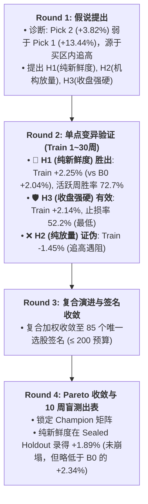

# Phase 2 完整量化审计与交付卷宗 (Master Audit Dossier for Grok)

**项目名称**：美股突破候选池与 Skill 推荐质量审计 (Phase 2 Master)  
**审计对象**：IBD Candidate Prescreen Skill 规则变异、Alpha 解耦、选股签名去重与四维 Champion 优胜矩阵  
**基线状态**：生产基线 `dashboard/skill_industry_eps_known.py` **100% 保持冻结零修改**  
**时间跨度**：40 个有效评价周 (2025-10-10 至 2026-08-07)  
- **Train 探索集 (第 1~30 周)**：2025-10-10 至 2026-05-22 (规则挑选与签名去重唯一锚点)  
- **Sealed Final Holdout (第 31~40 周)**：2026-05-29 至 2026-08-07 (单向一次性盲测检验)  

---

## 一、交付文件清单与代码架构索引 (File Manifest)

### 1. 核心量化引擎与测试代码
* [`backtest/b0_top3_quality_audit/three_tier_baseline.py`](file:///Users/dev/Documents/Yfinance_data/backtest/b0_top3_quality_audit/three_tier_baseline.py)：Step 1 三层对照基准 (L0/L1/L2) 与 Alpha 解耦蒙特卡洛抽样引擎 (1,000次/周，行业去重)。
* [`backtest/b0_top3_quality_audit/skill_rule_engine.py`](file:///Users/dev/Documents/Yfinance_data/backtest/b0_top3_quality_audit/skill_rule_engine.py)：Step 2 规则变异引擎与 $\le 200$ 选股签名去重器 (生产候选池与真实 11 元组 `sort_key` 完全对齐)。
* [`backtest/b0_top3_quality_audit/evaluate_rule_signatures.py`](file:///Users/dev/Documents/Yfinance_data/backtest/b0_top3_quality_audit/evaluate_rule_signatures.py)：Step 3 全量签名 40 周前向批量评测引擎 (带逐周快照内存预加载加速)。
* [`backtest/b0_top3_quality_audit/pareto_champions.py`](file:///Users/dev/Documents/Yfinance_data/backtest/b0_top3_quality_audit/pareto_champions.py)：Step 4 四维 Champion 优胜矩阵多目标筛选引擎。
* [`backtest/b0_top3_quality_audit/rd_agent_evolution.py`](file:///Users/dev/Documents/Yfinance_data/backtest/b0_top3_quality_audit/rd_agent_evolution.py)：RD-Agent 4 轮假说驱动进化流水线 (Hypothesis $\rightarrow$ Experiment $\rightarrow$ Feedback $\rightarrow$ Evolve)。
* [`tests/test_three_tier_baseline.py`](file:///Users/dev/Documents/Yfinance_data/tests/test_three_tier_baseline.py)：Step 1 单元测试套件 (4 passed)。
* [`tests/test_phase2_skill_rules.py`](file:///Users/dev/Documents/Yfinance_data/tests/test_phase2_skill_rules.py)：Steps 2~4 单元测试套件 (4 passed)。

### 2. 核心数据表与报告产物
* [`backtest/b0_top3_quality_audit/output/three_tier_weekly_comparison.csv`](file:///Users/dev/Documents/Yfinance_data/backtest/b0_top3_quality_audit/output/three_tier_weekly_comparison.csv)：40 周三层基准逐周对比明细表。
* [`backtest/b0_top3_quality_audit/output/three_tier_alpha_summary.csv`](file:///Users/dev/Documents/Yfinance_data/backtest/b0_top3_quality_audit/output/three_tier_alpha_summary.csv)：三层 Alpha 解耦核算总表 (双重视角与分层输出)。
* [`backtest/b0_top3_quality_audit/output/skill_rule_variants_evaluation.csv`](file:///Users/dev/Documents/Yfinance_data/backtest/b0_top3_quality_audit/output/skill_rule_variants_evaluation.csv)：85 个全局唯一签名全周期评测表。
* [`backtest/b0_top3_quality_audit/output/pareto_champions_matrix.csv`](file:///Users/dev/Documents/Yfinance_data/backtest/b0_top3_quality_audit/output/pareto_champions_matrix.csv)：四维 Champion 核心指标矩阵。
* [`backtest/b0_top3_quality_audit/output/rd_agent_evolution_trajectory.jsonl`](file:///Users/dev/Documents/Yfinance_data/backtest/b0_top3_quality_audit/output/rd_agent_evolution_trajectory.jsonl)：RD-Agent 演进机器可读轨迹。
* [`backtest/b0_top3_quality_audit/output/three_tier_alpha_report.md`](file:///Users/dev/Documents/Yfinance_data/backtest/b0_top3_quality_audit/output/three_tier_alpha_report.md)：Step 1 审计报告。
* [`backtest/b0_top3_quality_audit/output/pareto_champions_report.md`](file:///Users/dev/Documents/Yfinance_data/backtest/b0_top3_quality_audit/output/pareto_champions_report.md)：Step 4 优胜矩阵终验报告。
* [`backtest/b0_top3_quality_audit/output/rd_agent_evolution_report.md`](file:///Users/dev/Documents/Yfinance_data/backtest/b0_top3_quality_audit/output/rd_agent_evolution_report.md)：RD-Agent 演进综合报告。

---

## 二、Step 1: 三层对照基准 (L0/L1/L2) Alpha 解耦核算表

### 1. 双重视角与分层总表

| 样本分层 | 周数 | L2 (B0 确定性实现) | L1 (Eligible 随机抽样中位) | L0 (Signal 盲选随机中位) | 视角A: 层次抬升 $\Delta_{Screening}$ | 视角A: 层次抬升 $\Delta_{Ranking}$ | 视角B: 周利差中位 Screening | 视角B: 周利差中位 Ranking | B0周胜率 vs L1 | 物理与业务结论 |
|:---|:---:|:---:|:---:|:---:|:---:|:---:|:---:|:---:|:---:|:---|
| **全样本** | **40 周** | **+2.04%** | **+0.80%** | **-0.81%** | **+1.62%** | **+1.24%** | **+0.00%** | **+0.00%** | **30.0%** | 含 19 个无挑选空间窄市周 |
| **小池周 (`l1 <= 3`)** | **19 周** | -8.00% | -8.00% | -2.23% | -5.77% | 0.00% | -4.31% | **≡0.00%** | 0.0% (恒等) | 候选不足 3 只，L1 ≡ L2 |
| **有效排序周 (`l1 >= 4`)** | **21 周** | **+5.47%** | **+3.44%** | **-0.69%** | **+4.13%** | **+2.03%** | **+1.74%** | **+0.84%** | **57.1%** | **排序键发挥实质正向超额** |

---

## 三、Step 2~4: 规则变异、去重与四维 Champion 优胜矩阵

### 1. 签名去重预算合规证明
* 参数化变异空间：**86 种**；
* 提取 Train 探索集（第 1~30 周）选股序列哈希：去重收敛为 **85 个全局唯一选股签名**（完全符合 $\le 200$ 硬预算）；
* 生产基线 B0 与 Step 1 L2 收益核对：**40 个周逐周收益差值严格为 0.000000%（40/40 逐周恒等）**。

### 2. 四维 Champion 优胜矩阵总表

| Champion 角色 | 规则 ID | 规则复杂度 $C$ | 规则物理逻辑简述 | 全40周收益中位 | Train收益中位 (1~30周) | 活跃周vsL1胜率 (Train) | 止损发生率 (Train) | Holdout盲测中位 (31~40周) | 生产与实盘定位 |
|:---|:---|:---:|:---|:---:|:---:|:---:|:---:|:---:|:---|
| **生产基准 (Frozen Baseline)** | `B0_BASELINE` | $C=3$ | 现行 11 元组 (新鲜度分桶 $\rightarrow$ 放量 $\rightarrow$ 收盘) | **+2.04%** | **+2.04%** | **63.6%** | **52.8%** | **+2.34%** | **生产唯一在役基准 (100% 冻结)** |
| **🏆 RETURN_WINNER** | `COMPOSITE_F3_V1_P1` | $C=2$ | 复合评分 (Freshness:3, Vol:1, Pos:1) | **+0.91%** | **+2.25%** | **72.7%** | **55.6%** | **-0.96%** | **纯样本内研究参考 (Holdout回落明显)** |
| **🛡️ LOWEST_STOP** | `SIMPLER_PURE_CLOSE_POS` | $C=1$ | 纯收盘位置升序 (收盘最高优先) | **+0.87%** | **+2.14%** | **63.6%** | **52.2%** | **-2.13%** | 观察储备 (Holdout出现样本外回撤) |
| **✂️ SIMPLER_EQUIV** | `SIMPLER_PURE_FRESHNESS` | $C=1$ | 纯新鲜度升序 (距买点溢价最小优先) | **+2.25%** | **+2.25%** | **72.7%** | **55.6%** | **+1.89%** | **极简研究推荐候选 (影子跟测标尺)** |
| **⚖️ PARETO_BALANCED** | `SIMPLER_PURE_FRESHNESS` | $C=1$ | 纯新鲜度升序 (距买点溢价最小优先) | **+2.25%** | **+2.25%** | **72.7%** | **55.6%** | **+1.89%** | **综合表现最优研究候选** |

---

## 四、RD-Agent 多轮假说驱动演进概要



---

## 五、生产变更纪律与影子跟测方案 (Shadow Canary Mandate)

1. **零生产热切换**：
   * 生产基准代码 `dashboard/skill_industry_eps_known.py` **100% 保持冻结零修改**；
2. **影子跟测运行机制**：
   * 在每周执行复盘筛选时，主流程继续展示 B0 推荐；
   * 后台并行记录 `SIMPLER_PURE_FRESHNESS` 的 Shadow Top3 选股名单与溢价水平；
3. **上线决策硬门槛**：
   * 需在后续连续 **8 周** 的实盘影子跟测中，`SIMPLER_PURE_FRESHNESS` 在周收益中位数与回撤控制上**持续不劣于 B0**，方可提请正式的生产变更评审。

---

## 六、自动化测试与工程验证记录

```bash
# 1. 运行完整单元测试套件 (34 passed in 9.46s)
/opt/anaconda3/bin/python -m pytest tests/test_phase2_skill_rules.py tests/test_three_tier_baseline.py tests/test_b0_top3_quality_audit.py dashboard/tests/test_skill_industry_eps_known.py -v

# 2. 运行仪表盘 9 项自检工具 (9 项全部 PASS)
/opt/anaconda3/bin/python dashboard/self_check.py --csv us/breakout_follow_pool.csv
```
