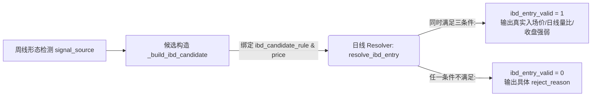

# BreakoutFollow Pool 数据结构与计算白皮书

本文件是量化交易系统（Quant Trade System）中 `BreakoutFollow` 策略股票池（对应持久化文件：`Yfinance_data/us/breakout_follow_pool.csv`）的全字段数据规范、物理计算方法与业务架构指南。

所有修改本字段结构、新增信号或调整底层排序机制的开发与代码审查，必须优先参照本文档及仓库根目录的 [AGENTS.md](../../AGENTS.md) 架构指南。

---

## 一、 核心设计准则与架构契约

### 1. 三层字段严格解耦（AGENTS.md 契约）
在整个策略层与入场解析层之间，以下三个核心概念字段必须在物理与语义上保持严格分离，严禁混淆使用：

* **`signal_source`（策略层叙事与优先级标签）**：说明“本周为什么把这只股票视为主信号”。它是策略展示、报表叙事以及当周并发信号冲突时的唯一胜出标签。
* **`ibd_candidate_rule`（IBD 候选验证路由分类）**：说明“该候选属于哪类具体的图表形态”。它直接控制底层日线 Resolver（`resolve_ibd_entry`）的校验路由与分发逻辑。
* **`ibd_candidate_price`（日线确认触发标杆价）**：日线 Resolver 用来验证真正突破有效性的绝对标尺价（Trigger Price），必须代表真实入场确认的临界线，**绝不能**仅仅作为背景参考锚点。

### 2. 主信号触发完整性与优先级机制
当前 `breakout_follow_pool.csv` 表中的布尔字段 `signal` 涵盖了 BreakoutFollow 策略体系内**所有的 5 个周线形态条件**（无任何遗漏）：
$$\text{signal} = \text{ema\_signal} \lor \text{is\_just\_breakout} \lor \text{is\_ceiling\_pullback} \lor \text{has\_pivot\_break} \lor \text{is\_twk\_breakout}$$

| 触发变量名 | 形态条件定义 | 对应 `signal_source` 叙事标签 | 对应 `ibd_candidate_rule` 日线路由 |
| :--- | :--- | :--- | :--- |
| **`is_just_breakout`** | **Phase 1: 首次天花板突破** 最新周首次越过大型基底顶部平台 `ceiling` | `ceiling_breakout` | `ceiling` (结构突破类) |
| **`is_ceiling_pullback`** | **Phase 2: 天花板回踩确认** 突破后首次回撤至天花板支撑上方并确认反弹 | `ceiling_breakout` | `ceiling_pullback` (非 Pivot 确认类) |
| **`has_pivot_break`** | **中/小型箱体阻力突破** 上升趋势中收盘越过 S_BOX 或 M_BOX 箱体阻力位 | `pivot` | `pivot` (结构突破类) |
| **`is_twk_breakout`** | **紧缩再启动 (至少3周)** 经历 O'Neil 至少连续 3 周及以上的收盘紧缩蓄势后向上突破 | `three_weeks_tight_breakout` | `three_weeks_tight` (非 Pivot 确认类) |
| **`ema_signal`** | **10 周均线回踩反弹** 触及 10 周线买入缓冲带 (`+0.3 ATR`) 后收盘反弹确认 | `10_wk_ema_touch_confirm` | `ma10_touch_confirm` (非 Pivot 确认类) |

> [!NOTE]
> **多信号并发优先级规则**：
> 当同一周多个周线条件同时触发时，主信号和 `signal_source` 按照以下唯一优先级排序判定：
> 1. `ceiling_breakout` (首次突破 Ceiling 或首次回踩确认)
> 2. `pivot` (中/小型箱体阻力突破)
> 3. `three_weeks_tight_breakout` (至少三周紧缩再启动)
> 4. `10_wk_ema_touch_confirm` (10周线回踩反弹确认)
>
> *注：若 `pivot` 与 `three_weeks_tight_breakout` 或 `10_wk_ema_touch_confirm` 同周重合，则**覆盖**后两者，主叙事和 IBD 候选规则均按 `pivot` 输出。*

#### 💡 补充说明：关于全局 IBD 规则中的 `m_breakout`
在系统底层日线引擎 `ibd_entry.py` 的规则字典中，还支持第 6 种规则 **`m_breakout`（W底/双底形态中峰突破）**。为什么 `breakout_follow_pool.csv` 中没有？
* 因为系统坚持高内聚低耦合与模块化解耦设计，将双底形态独立拆分为专属策略类 `StrategyIbdDoubleBottom`（对应源码 `strategy_ibd_double_bottom.py`）。
* 该双底策略执行结果独立输出至 `ibd_double_bottom_live_{period}.csv`，不与 `breakout_follow_pool.csv` 混淆。但二者在最后确认关卡，复用同一个日线放量确认算子（`resolve_ibd_entry`）。

### 3. Ceiling 体系的两阶段生命周期
`ceiling_breakout` 作为主策略标签 (`signal_source`)，统辖大型基底突破后的**两个演进阶段**：

| 演进阶段 | 策略标签 (`signal_source`) | 底层路由 (`ibd_candidate_rule`) | 标尺触发价 (`ibd_candidate_price`) | 核心语义与路由逻辑 |
| :--- | :--- | :--- | :--- | :--- |
| **Phase 1: 初始突破** | `ceiling_breakout` | `ceiling` | `ceiling` | 对形态平台颈线 (`ceiling`) 的首波直接越过。属于**结构突破类**。 |
| **Phase 2: 首次回踩** | `ceiling_breakout` | `ceiling_pullback` | `pending_high` | 初始突破后，在平台上方缩量回撤至 `ceiling` 支撑带，并反弹突破回踩期高点 (`pending_high`)。属于**非 Pivot 确认类**。 |

> [!IMPORTANT]
> **回踩确认的边界与破位重置准则**：
> * **非独立大类**：`ceiling_pullback` 不是独立主策略，亦非 Pivot（箱体阻力突破），它仅为 `ceiling_breakout` 叙事下的第二阶段确认，原 `ceiling` 固化入 `extra` 作为支撑上下文。
> * **破位即重置**：回踩确认的前提是股价始终延续在平台上方运行；**若某周收盘破位（`Close <= ceiling`），回踩延续态即告终结**。后续若重新站回平台，系统将重置为**全新的 Phase 1 初始突破**（`ceiling`），绝不沿用上一轮旧状态。

## 二、 股票池 37 个全字段字典与计算公式详解

为了解决 Markdown 表格中长文本公式导致列宽挤压、折行难读的问题，本部分遵循「**结构清爽、详略分层**」的设计原则，将所有 37 个字段按物理功能划分为六大模块。
每个模块提供两层解构：
1. **精简汇总表（Summary Table）**：快速扫描字段名、数据类型与核心语义。
2. **计算与推导规则（Calculation & Rules）**：独立展示复杂的数学公式、状态机判断与枚举值定义，确保排版优美清晰。

---

### 模块 1：基础标识与元数据 (Metadata & Identifiers)

| 列名 | 数据类型 | 核心语义与用途 |
| :--- | :--- | :--- |
| **`code`** | `str` | 股票标准代码 (Ticker)，来源于系统数据池或 `stage2_whitelist` 白名单。 |
| **`snapshot_date`** | `str` | 策略生成该行数据时对应的最新有效周线 K 线截止日期 (`YYYY-MM-DD`)。 |
| **`breakout_date`** | `str` | 收盘价首次向上越过 `ceiling` 天花板阻力的起算周日期。 |
| **`hold_return`** | `float` | 自突破起算周以来的百分比持仓收益率(%)。 |
| **`sector`** | `str` | 股票所属 GICS 板块名称（纯展示字段，不参与计算与排序）。 |
| **`industry`** | `str` | 股票所属 GICS 细分行业名称（纯展示字段，不参与计算与排序）。 |

#### 📐 计算与算法规则
* **`breakout_date` (有效突破起算周)**：由 `_find_breakout_date` 采用**无状态自右向左动态回溯**算法重算——自最新周向前追踪，直至遇到收盘价在 `ceiling` 之下的周期为止；若全周期均在上方则回退至第一根 K 线。
* **`hold_return` (持仓收益率)**：提取 `breakout_date` 对应周收盘价 $C_{bd}$，计算最新周收盘价 $C_{latest}$ 相对其的变化率：
  $$\text{hold\_return} = \text{round}\left(\frac{C_{latest} - C_{bd}}{C_{bd}} \times 100,\ 1\right)$$

---

### 模块 2：策略主信号与叙事标签 (Weekly Signals & Priority)

| 列名 | 数据类型 | 核心语义与用途 |
| :--- | :--- | :--- |
| **`signal`** | `bool` | 本周是否触发五大核心周线形态条件之一（是=`True`，否=`False`）。 |
| **`signal_source`** | `str` | 本周主信号的核心叙事标签，由系统独占优先级排位唯一决定。 |

#### 📐 计算与算法规则
* **`signal` (主信号判定公式)**：
  $$\text{signal} = \text{ema\_signal} \lor \text{is\_just\_breakout} \lor \text{is\_ceiling\_pullback} \lor \text{has\_pivot\_break} \lor \text{is\_twk\_breakout}$$
* **`signal_source` (独占优先级排位)**：同周满足多个条件时，按排位顺序赋予唯一标签：
  $$\text{ceiling\_breakout} > \text{pivot} > \text{three\_weeks\_tight\_breakout} > \text{10\_wk\_ema\_touch\_confirm} > \text{""}$$

---

### 模块 3：形态基底与阻力特征 (Base Profile & Resistance)

| 列名 | 数据类型 | 核心语义与用途 |
| :--- | :--- | :--- |
| **`ceiling`** | `float` | 大型基底平台顶部的天花板阻力 / 颈线价位，为多头核心防线。 |
| **`ceiling_date`** | `str` | 大型基底构筑的起始时间点（视觉起始位置，`YYYY-MM-DD`）。 |
| **`pct_above_ceiling`** | `float` | 当前收盘价高出天花板阻力的百分比幅度(%)，衡量脱离颈线的安全距离。 |
| **`base_depth_pct`** | `float` | 基底构筑期内最大回调深度百分比(%)，因在颈线下方，**始终为负数**。 |
| **`base_depth_abs`** | `float` | 基底绝对洗盘深度标量，为 `base_depth_pct` 的绝对值，**始终为正数**。 |
| **`base_mbox_count`** | `int` | 基底构筑期间内部经历的中期箱体 (`M_BOX`) 数量，反映换手充分度。 |
| **`mbox_count`** | `int` | 突破基底进入主升行情以来，延续上升趋势中新突破的 `M_BOX` 数量。 |
| **`touched_ema10_count`** | `int` | 突破后价格下探 10 周均线缓冲带并成功收盘反弹确认的轮次。 |

#### 📐 计算与算法规则
* **`ceiling` (天花板阻力)**：由 `_calc_ceiling_profile` 数据驱动自动识别。当 L_BOX 阻力点 $\ge 3$ 个时，采用**时间间隙法**（以最大时间间隙划定起点）；否则采用**全量法**。公式：
  $$\text{ceiling} = \max(\text{基底内 L\_BOX 阻力} + \text{最后一个 L\_BOX 起始前的 M\_BOX 阻力})$$
* **`ceiling_date` (基底开始日期)**：在参与 ceiling 计算的阻力点集合中，以 5% 容差（`RES >= 0.95 * ceiling`）筛选与 ceiling 同一价格带的所有阻力日期，取最早日期 `min()`。
* **`pct_above_ceiling` (高出天花板幅度)**：
  $$\text{pct\_above\_ceiling} = \text{round}\left(\frac{\text{Close} - \text{ceiling}}{\text{ceiling}} \times 100,\ 1\right)$$
* **`base_depth_abs` 与 `base_depth_pct`**：`base_depth_pct` 为平台构筑期最低价相对 ceiling 的回撤；`base_depth_abs = abs(base_depth_pct)`，作为 `C_continuous` 的正向动能权重。
* **`base_mbox_count`**：统计 `[ceiling_date, breakout_date)` 区间内，`Filter == True` 的 M_BOX 活跃阻力点落在该区间内的总数。
* **`touched_ema10_count` (10周线确认轮次)**：价格触及 10 周 **SMA** 缓冲带（`Low <= SMA10W + 0.3 * ATR`）后，收盘突破追踪回踩高点 (`pending_high`) 确认次数。
  * *注：函数名保留 "ema10" 仅为历史兼容，底层实际使用 `MA_50D`（周线自适应为 `SMA(Close, 10)`）。若 `Close < SMA10W * 0.98` 则触发破位重置。*

---

### 模块 4：成交量与回撤蓄势画像 (Volume & Pullback Profile)

| 列名 | 数据类型 | 核心语义与用途 |
| :--- | :--- | :--- |
| **`volume_ratio`** | `float` | 当周成交量对比同期 10 周均量的相对量比。 |
| **`is_bullish`** | `bool` | 当周 K 线是否收盘不低于开盘（非阴线买导向 K 线）。 |
| **`is_priority`** | `bool` | 当周是否具备强劲成交量做多承接的高质量优先动能。 |
| **`pullback_count`** | `int` | 自突破以来，经历过显著阶梯式高位调档或波段回调的轮次。 |
| **`pullback_pct`** | `float` | 本轮（或最近一轮）回撤波段的最大洗盘深度(%)，**永远为负数**。 |
| **`pullback_pct_off_peak`** | `float` | 当前最新收盘价距离本轮次回撤高点的位置与乖离率(%)。 |
| **`pullback_v_is_dry`** | `bool` | 近期回撤窗口中是否显著极缩量（核心洗盘健康度指标）。 |

#### 📐 计算与算法规则
* **`volume_ratio` (周线量比)**：当周成交量 $V_{latest}$ 与 `V_SMA_50D` 的比率。`V_SMA_50D` 通过**周期自适应**计算：日线 = `SMA(V, 50)`，周线 = `SMA(V, 10)`。
* **`is_bullish` (非阴线判定)**：`is_bullish = (Close >= Open)`，来源于 `VolumeIndicator.V_IS_BUY`。
* **`is_priority` (高质量动能)**：
  $$\text{is\_priority} = (\text{volume\_ratio} \ge 1.3) \land \text{is\_bullish}$$
* **`pullback_count` (调档轮次)**：基于高水位线 (`cummax(Close)`) 跟踪，当 `Close < cummax` 时标记为回撤。统计突破后进入回撤的总轮次（间隔 $\le 1$ 根 K 线自动合并）。
* **`pullback_pct` (本轮回撤深度)**：回顾看谷底，诊断洗盘深度：
  $$\text{pullback\_pct} = \text{round}\left(\frac{Low_{trough} - High_{peak}}{High_{peak}} \times 100,\ 1\right)$$
* **`pullback_pct_off_peak` (距高点乖离)**：聚焦看现在。$< 0$ 说明仍在修复期；$\ge 0$ 说明已越过高点创出波段新高：
  $$\text{pullback\_pct\_off\_peak} = \text{round}\left(\frac{Close_{latest} - High_{peak}}{High_{peak}} \times 100,\ 1\right)$$
* **`pullback_v_is_dry` (极缩量健康度)**：对近几周回撤 K 线计算 **三因子缩量评分 (`dry_score`)**：
  1. **趋势项 (Slope)**：对回撤量能做 OLS 回归，斜率 $< 0$（量缩递减）；
  2. **水位项 (Level)**：回撤窗口内平均量 $< \text{SMA}(V,10)$ 基准；
  3. **地量项 (Extreme)**：窗口中至少 1 根周线量 $< 0.5 \times \text{SMA}(V,10)$ 基准。
  * **判定条件**：当满足以上任意 **$\ge 2$ 项**（即 `dry_score >= 2`），标记为 `True`。

---

### 模块 5：IBD 日线候选与入场确认契约 (IBD Candidate & Daily Resolver)

本模块承载由周线形态向日线精确量价确认过渡的握手层（由 `ibd_entry.py` 驱动）。

| 列名 | 数据类型 | 核心语义与用途 |
| :--- | :--- | :--- |
| **`ibd_candidate_rule`** | `str` | IBD 候选验证路由分类，控制日线如何判定突破的基础形态类别。 |
| **`ibd_candidate_price`** | `float` | 日线 K 线必须真实跨越的绝对标杆触发价 (Trigger Price)。 |
| **`ibd_candidate_signal_source`**| `str` | 候选来源标签，直接继承上游主策略的 `signal_source`。 |
| **`ibd_candidate_extra`** | `str` | JSON 结构化字符串，记录形态底层诊断与扩展上下文。 |
| **`ibd_entry_valid`** | `int` | 日线是否真实确认入场（有效=`1`，无效=`0`，非信号周=`NULL`）。 |
| **`ibd_entry_date`** | `str` | 信号周内首个满足严格契约三要素的实际确认日期 (`YYYY-MM-DD`)。 |
| **`ibd_entry_price`** | `float` | 实际建议成交入场价（考虑开盘跳空高开等情况）。 |
| **`ibd_trigger_price`** | `float` | 固化留存传入的基准触发价，便于复盘审计。 |
| **`ibd_entry_volume_ratio`** | `float` | 确认入场日线当日成交量对比前 50 日均量的倍数 (`Volume / SMA(V, 50)`)。 |
| **`ibd_entry_close_vs_trigger_pct`**| `float`| 突破当日收盘价超越触发价的百分比幅度，单纯用于诊断收盘强弱。 |
| **`ibd_entry_rule`** | `str` | 终极确认所用的入场规则，入场成功时回填对应的 `ibd_candidate_rule`。 |
| **`ibd_entry_reject_reason`**| `str` | 当验证失败 (`valid == 0`) 时，记录底层 Resolver 驳回的具体原因枚举。 |

#### 📐 计算与算法规则
* **`ibd_candidate_rule` (验证路由)**：
  * **结构突破类**：`ceiling`, `pivot`（直接验证价突破阻力线）。
  * **非 Pivot Trigger 类**：`ma10_touch_confirm`, `ceiling_pullback`, `three_weeks_tight`（触发价为形态回踩高点 `pending_high` 或紧缩高点）。
* **`ibd_candidate_signal_source` (继承来源)**：可取值 `ceiling_breakout`、`pivot`、`three_weeks_tight_breakout`、`10_wk_ema_touch_confirm` 或 `""`。
* **`ibd_entry_valid` (入场契约三要素)**：Resolver 逐日扫描，只有某天**同时满足三要素**才标记为 `1`：
  1. **盘中突破**：`Daily_High > ibd_candidate_price`
  2. **收盘企稳**：`Daily_Close > ibd_candidate_price`
  3. **绝对放量**：`Daily_Volume / SMA(Daily_V, 50) >= 1.5` *(计算均量时剔除突破当根)*
* **`ibd_entry_price` (成交价定位)**：若开盘直接跳空高开于触发价之上，取 **开盘价 (`Open`)**；否则取标准 **触发价 (`Trigger`)**：
  $$\text{ibd\_entry\_price} = \max(\text{Daily\_Open},\ \text{ibd\_candidate\_price})$$
* **`ibd_entry_close_vs_trigger_pct` (收盘强弱)**：
  $$\text{pct} = \frac{\text{Daily\_Close}}{\text{ibd\_trigger\_price}} - 1$$
  * *(注：若收盘冲高回落破位，会触发规则自动驳回，**绝对不允许**用该字段放宽入场限制)*
* **`ibd_entry_reject_reason` (全量 7 种驳回枚举)**：
  * `no_candidate`：候选规则为空（上游未生成有效入场候选）
  * `no_daily_detail`：数据源缺失对应周日线 K 线或覆盖不足
  * `invalid_candidate_price`：触发价缺失、$\le 0$ 或非法数字
  * `no_current_week_breakout`：信号当周无任何交易日高点与收盘同时越过触发价
  * `daily_volume_not_confirmed`：价破但量比 $< 1.5$，量能承接不足被驳回
  * `insufficient_volume_history`：突破日之前缺乏 50 根日线数据计算均量
  * `no_ibd_rule_for_signal`：候选规则不在支持的 IBD 路由表内

---

### 模块 6：连续潜力打分与优选展示 (C_continuous Ranking)

本模块承载有效信号池（`signal == True`）在实盘与复盘中统一的优选打分与排名秩序（由 `ranking.py` 控制）。

| 列名 | 数据类型 | 核心语义与用途 |
| :--- | :--- | :--- |
| **`C_continuous`** | `float` | 融合深度、安全位置、动能及新鲜度四维特征的持续爆发潜力综合打分 ($0.0 \sim 1.0$)。 |
| **`rank_C_continuous`** | `int` | 信号池最终优选排名序数 (`1, 2, 3...`)，决定 CSV 排序与 Futu 自选股推送展示顺序。 |

#### 📐 计算与算法规则
* **`C_continuous` (四维多项式打分公式)**：基于本期有效信号池 (`signal == True`) 内的**百分位分数 (`percentile()`)** 进行加权：
  $$\text{C\_continuous} = 2.5 \times \text{pct}(\text{base\_depth\_abs}) + 2.0 \times \text{pct}(\text{pct\_above\_ceiling}) + 0.5 \times \text{pct}(\text{volume\_ratio}) + 0.5 \times (\text{fresh\_touch} + \text{fresh\_pullback})$$
  * `fresh_touch`：当 `touched_ema10_count == 0`（首波行进中未回踩）取 `1.0`，否则取 `0.0`。
  * `fresh_pullback`：当 `pullback_count == 0`（未经历显著阶段调档）取 `1.0`，否则取 `0.0`。
  * *业务核心：重奖深度洗盘后首波强硬突破、且处于平台上方稳固安全区的龙头标的。*
* **`rank_C_continuous` (三重 Tie-break 排序机制)**：由高到低排名：
  1. **首要决策**：按 **`C_continuous`** 分数降序
  2. **平分决议 1**：按 **`base_depth_abs`** (绝对洗盘深度) 降序
  3. **平分决议 2**：按 **`volume_ratio`** (周线量比) 降序

