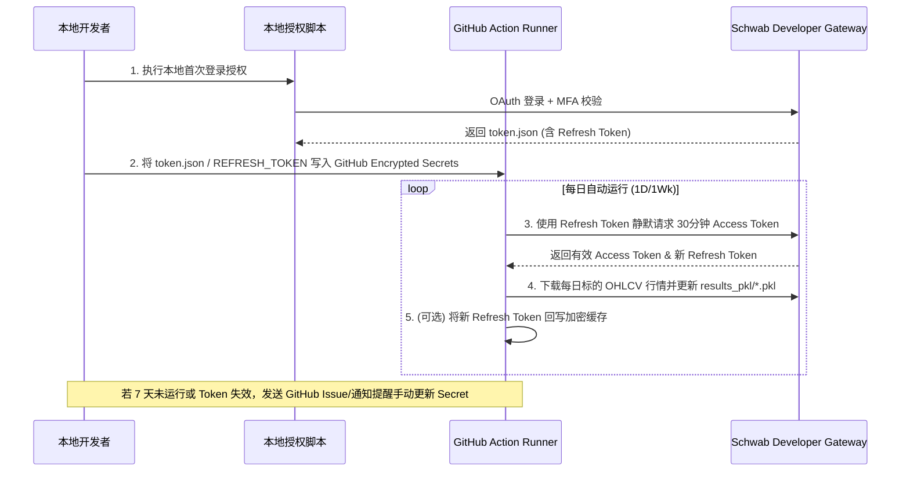

# 嘉信 (Charles Schwab) API 数据下载接入与多数据源 Provider 适配器设计文档

> [!IMPORTANT]
> **核心原则与存储契约（最高优先级）**：
> `results_pkl/*.pkl` 目录**仅保存和更新标的股票/ETF 的 OHLCV 日线/周线 K 线行情数据**。
> 无论数据提供者是 Yahoo Finance API 还是 Charles Schwab API，最终写入 `.pkl` 文件的 DataFrame Schema、数据类型和四舍五入精度必须 **100% 保持原有兼容**，确保下游 Screener（`stage2_screener`, `eps_screener` 等）和 Dashboard 绝不受任何影响。期权及实时行情仅作接口调研扩展，**绝不污染或写入 `results_pkl/*.pkl`**。

---

## 1. 概述与设计目标

为了增强数据源的可靠性与丰富度，本项目拟在现有的雅虎 API (`yfinance`) 行情下载逻辑基础上，引入嘉信理财 (Charles Schwab) 官方 API 数据接入方案，作为雅虎下载 API 的核心备选/替代方案。

### 核心设计原则
1. **多数据源适配器模式 (Provider Pattern)**：统一抽象数据下载接口，便于后续无缝扩展其他券商/数据源。
2. **零破坏与高兼容**：保持现有 `yfinance` 下载与筛选逻辑完全可用，默认参数保持默认调用 Yahoo API，不影响现有筛选器和 `results_pkl/*.pkl` 输出规范。
3. **严格存储契约控制**：
   - `results_pkl/*.pkl` 仅存放标的 **OHLCV K 线历史行情数据**（日线 `1d` / 周线 `1wk`）。
   - 字典 Key 必须为标准 Ticker 名称（如 `AAPL`, `BRK-B`）。
   - DataFrame 列标准必须严格遵循：`Date` (DatetimeIndex / String), `Open`, `High`, `Low`, `Close`, `Volume`（保留 2 位小数 `round(2)`）。
4. **最简实现控制影响范围**：以轻量包装和策略模式扩展 `DataStore.py`，凭证通过配置/参数传入，代码改动集中可控。
5. **支持 GitHub Actions 自动化**：解决 Schwab OAuth 2.0 令牌生命周期限制，提供可在 CI/CD 环境中稳定运行的自动化方案。

---

## 2. 嘉信开源 API 方案与官方文档调研

### 2.1 开源 Python 库选型与对比

| 开源库 | GitHub 仓库 | 特性与适用场景 | 评估结论 |
| :--- | :--- | :--- | :--- |
| **`schwab-py`** | [alexgolec/schwab-py](https://github.com/alexgolec/schwab-py) | 由原 `tda-api` 团队重构，类型安全，内置 OAuth Token 自动刷新与序列化（`token.json`），文档齐全。 | **推荐选用**（生产首选，稳定性高） |
| **`Schwabdev`** | [tylerebowers/Schwabdev](https://github.com/tylerebowers/Schwabdev) | 极简封装，支持同步/异步与 WebSockets 实时流，但 API 变更容错较低。 | 备选（适合自定义流数据扩展） |

### 2.2 官方 API 凭证与 OAuth 2.0 授权机制

根据 [Charles Schwab Developer Portal](https://developer.schwab.com/) 规范：
1. **凭证包含**：
   - `App Key` (Client ID)
   - `App Secret`
   - `Redirect URI`（例如：`https://127.0.0.1`）
2. **Token 生命周期**：
   - **Access Token**：有效期 **30 分钟**，用于发起 HTTP 行情数据 API 请求。
   - **Refresh Token**：有效期 **7 天**，用于静默向 Schwab 换取全新的 30 分钟 Access Token。
   - **7天强过期策略**：Schwab 出于安全限制，不支持完全无人值的永久 Token，超过 7 天 Refresh Token 失效后必须通过浏览器重新进行 MFA 用户登录授权。

---

## 3. 多数据源适配器架构设计 (Provider Pattern)

为了兼顾可维护性与低耦合，采用**适配器/策略模式 (Provider Pattern)**，整体架构如下：

```mermaid
graph TD
    CLI[DataStore CLI / Workflow] --> Factory[DataProviderFactory]
    Factory -->|--provider=yahoo (默认)| Yahoo[YahooDataProvider]
    Factory -->|--provider=schwab (备选)| Schwab[SchwabDataProvider]
    
    Yahoo -->|yfinance| YahooAPI[Yahoo Finance]
    Schwab -->|schwab-py / REST| SchwabAPI[Charles Schwab API]
    
    Yahoo --> DataPipeline[严格 OHLCV DataFrame 格式 & results_pkl/*.pkl 输出]
    Schwab --> DataPipeline
```

### 3.1 抽象接口 `BaseDataProvider`

创建数据提供者基类，规范统一的行情抓取方法：

```python
from abc import ABC, abstractmethod
import pandas as pd
from typing import Dict, List, Optional, Tuple

class BaseDataProvider(ABC):
    """数据提供者抽象基类"""
    
    @abstractmethod
    def download_single_stock(self, symbol: str, period: str = "1y", interval: str = "1d") -> Tuple[str, Optional[pd.DataFrame]]:
        """抓取单只股票的 K 线数据，返回标准 OHLCV DataFrame (Volume, Open, High, Low, Close)"""
        pass
        
    @abstractmethod
    def download_batch_stocks(self, symbols: List[str], period: str = "1y", interval: str = "1d") -> Tuple[Dict[str, pd.DataFrame], List[str]]:
        """批量抓取股票数据（仅将 OHLCV K 线数据保存至 results_pkl/*.pkl）"""
        pass
        
    @abstractmethod
    def fetch_option_chain(self, symbol: str) -> Optional[Dict]:
        """获取指定标的的期权链数据 (仅供接口调研，绝对不写入 results_pkl)"""
        pass
```

### 3.2 `YahooDataProvider` 实现

将现有 `DataStore.py` 中的 `download_single_stock` 和 `download_batch_stocks` 逻辑无缝移入 `YahooDataProvider` 中，逻辑 100% 继承现有处理。

### 3.3 `SchwabDataProvider` 实现与清洗契约

`SchwabDataProvider` 封装凭证注入逻辑，凭证信息通过构造函数或环境变量传入：

```python
class SchwabCredentials:
    """嘉信 API 凭证配置类"""
    def __init__(self, app_key: str, app_secret: str, callback_url: str = "https://127.0.0.1", token_path: str = "token.json"):
        self.app_key = app_key
        self.app_secret = app_secret
        self.callback_url = callback_url
        self.token_path = token_path

class SchwabDataProvider(BaseDataProvider):
    """基于 schwab-py 的嘉信数据提供者"""
    def __init__(self, creds: SchwabCredentials):
        self.creds = creds
        self.client = self._init_client()

    def _init_client(self):
        import schwab
        return schwab.auth.client_from_token_file(
            token_path=self.creds.token_path,
            api_key=self.creds.app_key,
            app_secret=self.creds.app_secret
        )
```

> [!NOTE]
> **数据清洗契约 (Data Cleaning Contract)**：
> Schwab API 返回的原始 K 线节点（如 `candles: [{open, high, low, close, volume, datetime}]`）会被严格映射清洗为下述结构：
> - 列名强制与 Yahoo 对齐：`['Open', 'High', 'Low', 'Close', 'Volume']`
> - 数值精度统一执行 `.round(2)`
> - Index 为 DatetimeIndex
> 这样生成的 Pickle 文件在文件格式、结构与内容上与 Yahoo 产生的文件完全等价。

### 3.4 工厂模式与 CLI 集成 (`DataProviderFactory`)

在 `DataStore.py` 中增加 `--provider` 参数：

```bash
# 默认使用雅虎 API（保持原有使用习惯）
python DataStore.py --period=2y --interval=1d

# 使用嘉信 API 备选方案（需传入凭证或配置环境变量）
python DataStore.py --provider=schwab --app-key=XXX --app-secret=YYY --token-path=token.json --period=2y --interval=1d
```

---

## 4. GitHub Actions 自动化工作流设计

### 4.1 Schwab OAuth 7天刷新机制在 CI/CD 中的应对方案

由于 GitHub Actions 环境无 GUI 界面，且 Schwab 7 天强失效机制限制，设计**“本地授权 + Secrets 自动刷新存取”**工作流：



### 4.2 GitHub Secrets 配置项
在 GitHub Repository Settings -> Secrets and variables -> Actions 中新增：
- `SCHWAB_APP_KEY`: 嘉信开发者 App Key
- `SCHWAB_APP_SECRET`: 嘉信开发者 App Secret
- `SCHWAB_TOKEN_JSON`: 加密存储的 `token.json` Base64 字符串

### 4.3 新增专属 GitHub Action 流程
在 `.github/workflows/` 下新增 `data-update-schwab-1d.yml`，与原 `data-update-1d.yml`（Yahoo 版）并行，互不干扰。

---

## 5. 嘉信交易日实时行情 (Real-Time Quotes) API 调研

针对交易日（盘中）实时行情的获取，嘉信 API 提供了 **REST 快照** 与 **WebSocket 实时流** 两种模式（均仅供行情点查与实时预警，不写入 `results_pkl/`）：

### 5.1 模式一：REST 行情快照 API (`/marketdata/v1/quotes`)

- **接口地址**：`GET /marketdata/v1/quotes` 或 `GET /marketdata/v1/{symbol}/quotes`
- **使用场景**：盘中低频点查、特定标的当前最新价查询。
- **返回字段**：`lastPrice`, `bidPrice/askPrice`, `bidSize/askSize`, `totalVolume`, `netPercentChange` 等。
- **限流规则**：REST API 限制为 **120 请求/分钟**。支持在单个 Request 中传入多个 symbol（如 `symbols=AAPL,MSFT,NVDA`）批量点查。

### 5.2 模式二：WebSocket 实时长连接流 (`StreamClient`)

- **使用场景**：交易日盘中高频/实时监控，如盘中突破（Breakout）信号实时预警。
- **服务类型**：`LEVELONE_EQUITIES`（股票 Level 1 实时报价推送）。
- **工作机制**：在 `schwab-py` 中通过 `StreamClient` 建立长连接，基于 Python `asyncio` 事件循环接收推送，延迟低且不消耗 HTTP 请求配额。

---

## 6. 嘉信期权数据 API (Options Chain) 调研

- **接口地址**: `/marketdata/v1/chains`
- **使用场景与范围**：获取 Call/Put 报价、隐含波动率 (IV)、Delta/Gamma/Theta/Vega 希腊字母。仅供后续策略研究使用，**数据绝不进入 `results_pkl/*.pkl`**。

---

## 7. 回测框架集成与对比调研

配合 Schwab 数据源，可无缝集成的 3 种主流 Python 回测框架：

| 框架名称 | 集成难度 | 优势 | 适用场景 | 与本项目集成方式 |
| :--- | :--- | :--- | :--- | :--- |
| **Backtrader** | 低 | 经典事件驱动，灵活度高，生态成熟。 | 多因子策略、K 线突破与止盈止损回测。 | 直接将 Schwab 输出的 `results_pkl/*.pkl` 转化为 `bt.feeds.PandasData`。 |
| **Vectorbt** | 低 | 基于 NumPy 矩阵计算，回测速度极快（数万标的秒级计算）。 | 候选池标的大规模参数扫描、突破信号向量化验证。 | 读取 `results_pkl` 转化为 Wide DataFrame（列为 Ticker，行为 Date）进行向量计算。 |
| **Lumibot** | 中 | 原生支持 Schwab API 交易与回测统一接口。 | 策略从回测到 Schwab 实盘交易的一站式桥接。 | 引入 Lumibot 的 Schwab Broker 模块进行实盘模拟。 |

---

## 8. 代码影响范围与最简改动计划

### 8.1 文件变动列表

| 动作 | 文件路径 | 职责说明 |
| :--- | :--- | :--- |
| **新建** | `data_providers/__init__.py` | 数据提供者包初始化 |
| **新建** | `data_providers/base_provider.py` | `BaseDataProvider` 接口定义 |
| **新建** | `data_providers/yahoo_provider.py` | 封装现有 Yahoo 抓取逻辑（100% 保持原有重试与线程池逻辑） |
| **新建** | `data_providers/schwab_provider.py` | 实现 Schwab K 线数据与期权/实时行情接口 |
| **新建** | `dashboard/tests/test_datastore_providers.py` | 针对 DataProvider 适配器、Yahoo 原有逻辑与 Schwab Mock 的全新单元测试覆盖文件 |
| **修改** | `DataStore.py` | 引入 `DataProviderFactory` 与 CLI `--provider` 参数，原有 Yahoo 逻辑作为默认选项，核心流程完全兼容。 |
| **新建** | `.github/workflows/data-update-schwab-1d.yml` | 独立运行的 Schwab GitHub Action 任务 |

### 8.2 单元测试与现有雅虎逻辑测试用例覆盖设计

1. **雅虎下载提供者契约测试 (Yahoo Provider Contract Test)**：
   - 使用 `unittest.mock` Mock 外部 `yfinance.Ticker.history` 接口，测试并发批量下载 `download_batch_stocks`、单股重试机制 `download_single_stock` 以及失败重试逻辑。
   - 验证 `YahooDataProvider` 的输出格式与现有 `DataStore.py` 导出的 `results_pkl/*.pkl` 完全一致（包含 `Open, High, Low, Close, Volume` 列名与精度四舍五入）。
   - 验证默认命令行调用 `DataStore.py` 时在不指定 `--provider` 的情况，100% 路由至 `YahooDataProvider`，行为完全回归零影响。

2. **嘉信下载提供者 Mock 单元测试 (Schwab Provider Mock Test)**：
   - 通过 Mock `schwab.auth.client_from_token_file` 和 `schwab_client.get_price_history`，验证 Schwab 返回数据向标准 DataFrame 格式的字段转换。
   - 验证**只有标的 K 线行情**被持久化至 `results_pkl/*.pkl`，且文件结构与 Yahoo 完全全同。
   - 验证错误处理（如 Token 过期、API 限流）时的 Graceful Error 处理。

3. **工厂模式与向后兼容性断言 (Factory Backward Compatibility Assertions)**：
   - 验证 `DataProviderFactory.get_provider("yahoo")` 返回的实例行为与旧版本 `DataStore.py` 函数式调用完全等价。

### 8.3 验证与测试计划

1. **自动化测试套件运行**：
   ```bash
   conda run -n quant_env python -m pytest dashboard/tests/test_datastore_providers.py -v
   ```
2. **Yahoo 兼容性实测验证**：不传 `--provider` 执行 `python DataStore.py --screener-only` 及数据下载，确认现有 `results_pkl/*.pkl` 输出及后续 `eps_screener`, `stage2_screener` 完全不受影响。
3. **Schwab 抓取验证**：配置测试凭证，使用 `--provider=schwab` 抓取单个与批量股票，对比输出的 DataFrame 结构与 Yahoo 是否一致。
4. **实时行情与期权 API 验证**：分别测试 `/quotes` 点查与 `/chains` 接口返回，确认数据结构。
5. **自动化流程验证**：触发 GitHub Action 手动运行，验证 Secrets 解码与 Token 刷新逻辑。
